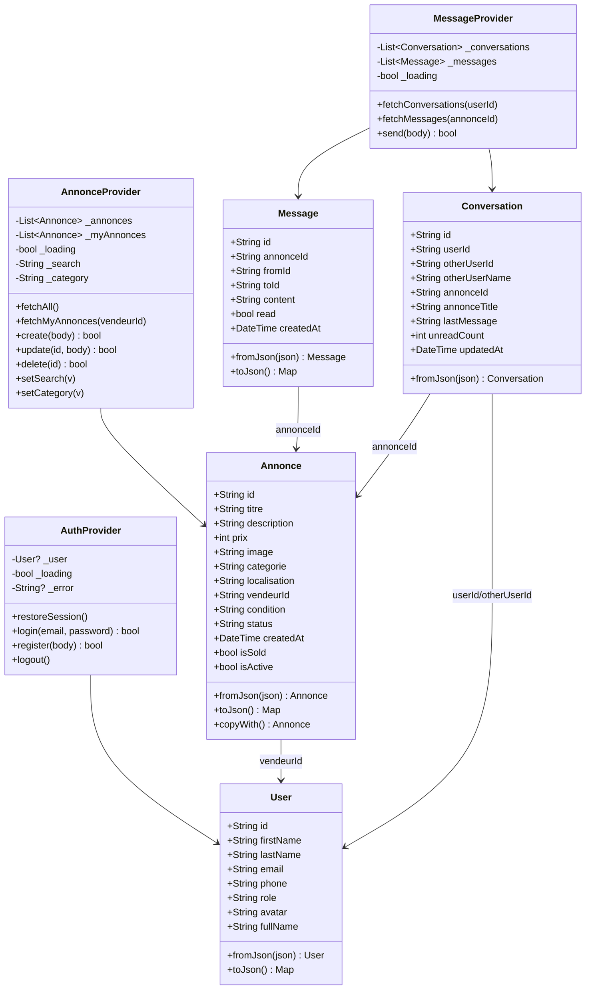

# DOSSIER DE CONCEPTION
## Application Mobile : Mini Marketplace

---

| Champ         | Détail                                      |
|---------------|---------------------------------------------|
| **Titre**     | Mini Marketplace – Application Mobile       |
| **Auteur**    | Abdoul Salam DIALLO                         |
| **Formation** | Développement Mobile Avancé – DCLIC         |
| **Date**      | Juillet 2026                                |
| **Version**   | 1.0.0                                       |

---

## 1. Présentation du projet

### 1.1 Contexte

Mini Marketplace est une application mobile de petites annonces développée avec Flutter et un backend Node.js (JSON Server). Elle permet à des particuliers de publier des annonces de vente, de consulter les offres disponibles et d'échanger directement avec les vendeurs via une messagerie intégrée. Le backend est déployé sur Render.com et le frontend est compatible Android et Web.

### 1.2 Problématique

Comment concevoir une application mobile légère, multiplateforme, permettant la publication et la consultation d'annonces avec messagerie intégrée, sans nécessiter d'infrastructure lourde ?

### 1.3 Objectifs

- Permettre l'inscription et la connexion avec persistance de session
- Afficher, filtrer et rechercher des annonces par catégorie ou mot-clé
- Permettre aux vendeurs de créer, modifier et supprimer leurs annonces
- Intégrer un système de messagerie entre acheteurs et vendeurs
- Déployer le backend sur un service cloud (Render)

---

## 2. Architecture générale

L'application suit le pattern **MVVM (Model-View-ViewModel)** adapté à Flutter via le package `provider`.

```
┌──────────────────────────────────────┐
│           Flutter Frontend           │
│                                      │
│  Screens (View)                      │
│      ↕ context.watch / context.read  │
│  Providers (ViewModel)               │
│      ↕ appel de méthodes             │
│  Services (Repository)               │
│      ↕ HTTP REST                     │
└──────────────┬───────────────────────┘
               │
┌──────────────▼───────────────────────┐
│   Backend JSON Server (Render)       │
│   /annonces /users /messages         │
│   /conversations /categories         │
└──────────────────────────────────────┘
```

### 2.1 Organisation des dossiers

```
frontend/lib/
├── main.dart              # Point d'entrée, initialisation MultiProvider
├── config/
│   └── api_config.dart    # URL backend (production / local)
├── models/                # Classes métier (Annonce, User, Message, Conversation)
├── services/              # Couche d'accès aux données (HTTP, image picker)
├── providers/             # Gestion d'état (ChangeNotifier)
├── screens/               # Écrans de l'application
└── widgets/               # Composants réutilisables

backend/
├── db.json                # Base de données JSON (données persistantes)
├── routes.json            # Routes personnalisées
└── package.json           # Configuration Node.js / json-server
```

---

## 3. Technologies utilisées

| Technologie | Version | Rôle dans le projet |
|---|---|---|
| Flutter | ≥ 3.4.0 | Framework UI multiplateforme (Android, Web) |
| Dart | ≥ 3.4.0 | Langage de programmation du frontend |
| Provider | 6.1.2 | Gestion d'état réactif (pattern ChangeNotifier) |
| HTTP | 1.2.2 | Requêtes REST vers le backend |
| SharedPreferences | 2.3.2 | Persistance locale de la session utilisateur |
| CachedNetworkImage | 3.4.1 | Chargement et mise en cache des images réseau |
| ImagePicker | 1.2.3 | Sélection d'images depuis la galerie (mobile) |
| dart:html | SDK | Sélection d'image via FileUploadInputElement (web) |
| intl | 0.19.0 | Internationalisation et formatage des dates |
| uuid | 4.4.2 | Génération d'identifiants uniques |
| JSON Server | 0.17.0 | API REST mock basée sur db.json |
| Node.js | 24.x | Environnement d'exécution du backend |
| Render.com | — | Hébergement cloud du backend |

### 3.1 Justification des choix

- **Flutter** : Développement multiplateforme avec une seule base de code (Android + Web).
- **Provider** : Solution officielle Flutter pour la gestion d'état, légère et adaptée à ce niveau de complexité.
- **JSON Server** : Permet de simuler une API REST complète sans développer un backend custom, idéal en contexte académique.
- **SharedPreferences** : Solution simple de stockage clé-valeur pour maintenir la session sans base de données locale complexe.
- **CachedNetworkImage** : Améliore les performances en évitant de retélécharger les images à chaque rendu.

---

## 4. Description des modules

### 4.1 Écran de démarrage — `splash_screen.dart`

Affiche le logo et le nom de l'application pendant 2 secondes avec une animation `FadeTransition`. Appelle `AuthProvider.restoreSession()` pour vérifier si une session est active, puis redirige vers `OnboardingScreen` ou `ShellScreen`.

**Classes** : `SplashScreen`, `_SplashScreenState` (avec `SingleTickerProviderStateMixin`)

---

### 4.2 Onboarding — `onboarding_screen.dart`

Présente l'application en 3 pages via un `PageView`. Chaque page (`_Page`) affiche une icône, un titre et un sous-titre. La dernière page propose les boutons "Se connecter" et "Créer un compte".

**Classes** : `OnboardingScreen`, `_OnboardingScreenState`, `_Page`

---

### 4.3 Connexion — `login_screen.dart`

Formulaire avec validation (email contenant `@`, mot de passe ≥ 4 caractères). Appelle `AuthProvider.login()`. En cas de succès, redirige vers `ShellScreen`. Affiche les identifiants de démonstration.

**Classes** : `LoginScreen`, `_LoginScreenState`

---

### 4.4 Inscription — `register_screen.dart`

Formulaire de 5 champs (prénom, nom, email, téléphone, mot de passe) avec sélection du rôle (Acheteur / Vendeur) via le widget `_RoleChoice`. Appelle `AuthProvider.register()`.

**Classes** : `RegisterScreen`, `_RegisterScreenState`, `_RoleChoice`

---

### 4.5 Shell principal — `shell_screen.dart`

Contient la `BottomNavigationBar` avec 4 onglets : Accueil, Catégories, Messages, Profil. Utilise une `GlobalKey` (`shellKey`) pour permettre la navigation programmatique depuis n'importe quel écran via `ShellScreen.jumpToTab()`.

**Classes** : `ShellScreen`, `_ShellScreenState`

---

### 4.6 Accueil — `home_screen.dart`

Affiche la liste des annonces dans un `GridView` (2 colonnes). Inclut une barre de recherche, des chips de catégories filtrantes et un bouton flottant "Créer annonce" visible uniquement pour les vendeurs. Gère les états : chargement, erreur backend, liste vide.

**Classes** : `HomeScreen`, `_HomeScreenState`

---

### 4.7 Catégories — `categories_screen.dart`

Affiche les 5 catégories (Électronique, Mode, Maison, Services, Véhicules) dans une liste. La sélection d'une catégorie navigue vers `_CategoryProducts` qui filtre les annonces via `AnnonceProvider.setCategory()`.

**Classes** : `CategoriesScreen`, `_CategoryProducts`, `_CategoryProductsState`

---

### 4.8 Détail annonce — `annonce_detail_screen.dart`

Charge l'annonce via `AnnonceService.getById()`. Affiche l'image (base64 ou réseau), le titre, le prix formaté, la condition, la localisation et la description. Si l'utilisateur est le propriétaire, affiche un bouton d'édition. Sinon, affiche "Contacter le vendeur" qui ouvre une dialog de messagerie.

**Méthode clé** : `_contactVendeur()` — crée le message, met à jour les conversations des deux parties et redirige vers l'onglet Messages.

**Classes** : `AnnonceDetailScreen`, `_AnnonceDetailScreenState`

---

### 4.9 Création d'annonce — `create_annonce_screen.dart`

Formulaire de création avec champs titre, catégorie, condition, description, prix, localisation et image. L'image est sélectionnée via `ImagePickerService.pickImage()` (galerie mobile ou FileUploadInputElement web) et stockée en base64. Si aucune image n'est fournie, une image Unsplash par défaut est utilisée.

**Classes** : `CreateAnnonceScreen`, `_CreateAnnonceScreenState`, `_ImagePicker`

---

### 4.10 Modification d'annonce — `modifier_annonce_screen.dart`

Formulaire pré-rempli avec les données de l'annonce existante. Appelle `AnnonceProvider.update()` et retourne à l'écran précédent en cas de succès.

**Classes** : `ModifierAnnonceScreen`, `_ModifierAnnonceScreenState`

---

### 4.11 Messagerie — `conversations_screen.dart`

Deux vues dans le même fichier :
- `ConversationsScreen` : liste les conversations de l'utilisateur avec nom, dernier message et badge de messages non lus.
- `ChatScreen` : affiche les messages d'une conversation avec bulles de dialogue différenciées (envoyé / reçu) et champ de saisie.

**Classes** : `ConversationsScreen`, `_ConversationsScreenState`, `ChatScreen`, `_ChatScreenState`

---

### 4.12 Profil — `profile_screen.dart`

Affiche avatar (initiale du nom), nom complet, email, rôle et téléphone. Pour les vendeurs, affiche la liste de leurs annonces via `AnnonceProvider.fetchMyAnnonces()`. Bouton de déconnexion dans l'AppBar.

**Classes** : `ProfileScreen`, `_ProfileScreenState`, `_MyAnnonces`

---

## 5. Description des modèles

### 5.1 `Annonce` — `models/annonce.dart`

| Attribut | Type | Description |
|---|---|---|
| id | String | Identifiant unique |
| titre | String | Titre de l'annonce |
| description | String | Description détaillée |
| prix | int | Prix en FCFA |
| image | String | URL ou données base64 |
| categorie | String | Code catégorie (c1–c5) |
| localisation | String | Ville ou quartier |
| vendeurId | String | Référence à l'utilisateur vendeur |
| condition | String | Neuf / Très bon état / Bon état / Occasion |
| status | String | active / sold |
| createdAt | DateTime | Date de publication |

**Propriétés calculées** : `isSold` (status == 'sold'), `isActive` (status == 'active')
**Méthodes** : `fromJson()`, `toJson()`, `copyWith()`

---

### 5.2 `User` — `models/user.dart`

| Attribut | Type | Description |
|---|---|---|
| id | String | Identifiant unique |
| firstName | String | Prénom |
| lastName | String | Nom de famille |
| email | String | Adresse email |
| phone | String | Numéro de téléphone |
| role | String | buyer / seller |
| avatar | String | URL avatar (non utilisé dans l'UI) |

**Propriétés calculées** : `fullName` (prénom + nom)
**Méthodes** : `fromJson()`, `toJson()`

---

### 5.3 `Message` — `models/message.dart`

| Attribut | Type | Description |
|---|---|---|
| id | String | Identifiant unique |
| annonceId | String | Annonce concernée |
| fromId | String | Expéditeur |
| toId | String | Destinataire |
| content | String | Contenu du message |
| read | bool | Lu ou non |
| createdAt | DateTime | Horodatage |

**Méthodes** : `fromJson()`, `toJson()`

---

### 5.4 `Conversation` — `models/message.dart`

| Attribut | Type | Description |
|---|---|---|
| id | String | Identifiant unique |
| userId | String | Propriétaire de cette vue |
| otherUserId | String | Interlocuteur |
| otherUserName | String | Nom de l'interlocuteur |
| annonceId | String | Annonce liée |
| annonceTitle | String | Titre de l'annonce |
| lastMessage | String | Dernier message échangé |
| unreadCount | int | Nombre de messages non lus |
| updatedAt | DateTime | Date dernière activité |

**Méthodes** : `fromJson()`

---

## 6. Gestion de l'état

L'application utilise le package **Provider** avec le pattern **ChangeNotifier**. Trois providers sont initialisés à la racine de l'application dans `main.dart` via `MultiProvider`.

### 6.1 `AuthProvider`

Gère l'état d'authentification.

| État | Type | Description |
|---|---|---|
| `_user` | User? | Utilisateur connecté |
| `_loading` | bool | Indicateur de chargement |
| `_error` | String? | Dernier message d'erreur |

**Méthodes publiques** :
- `restoreSession()` : recharge l'utilisateur depuis `SharedPreferences`
- `login(email, password)` : appelle `AuthService.login()`, sauvegarde la session
- `register(body)` : appelle `AuthService.register()`, sauvegarde la session
- `logout()` : vide `_user` et efface `SharedPreferences`

---

### 6.2 `AnnonceProvider`

Gère la liste des annonces et les filtres actifs.

| État | Type | Description |
|---|---|---|
| `_annonces` | List\<Annonce\> | Annonces filtrées affichées |
| `_myAnnonces` | List\<Annonce\> | Annonces du vendeur connecté |
| `_loading` | bool | Indicateur de chargement |
| `_error` | String? | Erreur réseau |
| `_search` | String | Texte de recherche actif |
| `_category` | String | Catégorie filtrée active |

**Méthodes publiques** :
- `fetchAll()` : récupère les annonces avec filtres actifs
- `fetchMyAnnonces(vendeurId)` : annonces d'un vendeur
- `create(body)` : crée une annonce et l'insère en tête de liste
- `update(id, body)` : met à jour une annonce
- `delete(id)` : supprime une annonce
- `setSearch(v)` / `setCategory(v)` : met à jour le filtre et relance `fetchAll()`

---

### 6.3 `MessageProvider`

Gère les conversations et messages.

| État | Type | Description |
|---|---|---|
| `_conversations` | List\<Conversation\> | Conversations de l'utilisateur |
| `_messages` | List\<Message\> | Messages de la conversation active |
| `_loading` | bool | Indicateur de chargement |

**Méthodes publiques** :
- `fetchConversations(userId)` : charge les conversations
- `fetchMessages(annonceId)` : charge les messages d'une conversation
- `send(body)` : envoie un message et l'ajoute localement

---

## 7. Navigation

### 7.1 Flux principal

```
main.dart
  └── SplashScreen (2s + animation)
        ├── [non connecté] → OnboardingScreen
        │     ├── → LoginScreen → ShellScreen
        │     └── → RegisterScreen → ShellScreen
        └── [connecté] → ShellScreen
```

### 7.2 ShellScreen (navigation par onglets)

```
ShellScreen (BottomNavigationBar)
  ├── [0] HomeScreen
  │     ├── → AnnonceDetailScreen
  │     │     ├── → ModifierAnnonceScreen (si propriétaire)
  │     │     └── Dialog contact → [jump] ConversationsScreen
  │     └── FAB → CreateAnnonceScreen (si vendeur)
  ├── [1] CategoriesScreen
  │     └── → _CategoryProducts → AnnonceDetailScreen
  ├── [2] ConversationsScreen
  │     └── → ChatScreen
  └── [3] ProfileScreen
        └── Logout → LoginScreen
```

### 7.3 Navigation programmatique

`ShellScreen` expose une `GlobalKey<_ShellScreenState>` (`shellKey`) permettant de changer d'onglet depuis n'importe quel écran via :

```dart
ShellScreen.jumpToTab(context, 2); // Navigue vers l'onglet Messages
```

---

## 8. Diagrammes UML

### 8.1 Diagramme de cas d'utilisation

```
┌─────────────────────────────────────────────────┐
│                  Mini Marketplace                │
│                                                 │
│  ┌──────────┐      ┌──────────────────────────┐ │
│  │          │─────►│ S'inscrire               │ │
│  │          │─────►│ Se connecter             │ │
│  │          │─────►│ Consulter les annonces   │ │
│  │Utilisateur│─────►│ Rechercher une annonce   │ │
│  │          │─────►│ Filtrer par catégorie    │ │
│  │          │─────►│ Voir le détail           │ │
│  │          │─────►│ Contacter un vendeur     │ │
│  │          │─────►│ Consulter les messages   │ │
│  └──────────┘      └──────────────────────────┘ │
│                                                 │
│  ┌──────────┐      ┌──────────────────────────┐ │
│  │          │─────►│ Publier une annonce      │ │
│  │ Vendeur  │─────►│ Modifier une annonce     │ │
│  │(extends  │─────►│ Supprimer une annonce    │ │
│  │Utilisat.)│─────►│ Voir ses annonces        │ │
│  └──────────┘      └──────────────────────────┘ │
└─────────────────────────────────────────────────┘
```

---

### 8.2 Diagramme de classes (Mermaid)



---

### 8.3 Diagramme de séquence — Contacter le vendeur

```
Acheteur    AnnonceDetailScreen    MessageProvider    MessageService    API Backend
    │               │                    │                  │               │
    │── tap bouton ─►│                    │                  │               │
    │               │── showDialog ──────►│                  │               │
    │── saisit msg ─►│                    │                  │               │
    │── confirme ──►│                    │                  │               │
    │               │── send(body) ──────►│                  │               │
    │               │                    │── MessageService.send() ─────────►│
    │               │                    │◄── Message créé ──────────────────│
    │               │                    │                  │               │
    │               │── upsertConversation() ──────────────►│               │
    │               │                    │                  │── GET convs ─►│
    │               │                    │                  │◄── résultat ──│
    │               │                    │                  │── POST/PATCH ►│
    │               │                    │                  │◄── OK ────────│
    │               │── ShellScreen.jumpToTab(2) ──────────►│               │
    │◄── ConversationsScreen affiché ────│                  │               │
```

---

## 9. Structure complète du projet

```
app-mobile/
├── backend/
│   ├── db.json                  # Données (users, annonces, messages, conversations)
│   ├── routes.json              # Routes personnalisées API
│   ├── package.json             # Dépendances Node.js
│   ├── render.yaml              # Config déploiement Render
│   └── README.md
│
├── frontend/
│   ├── lib/
│   │   ├── main.dart
│   │   ├── config/
│   │   │   └── api_config.dart
│   │   ├── models/
│   │   │   ├── annonce.dart
│   │   │   ├── message.dart
│   │   │   └── user.dart
│   │   ├── services/
│   │   │   ├── api_service.dart
│   │   │   ├── auth_service.dart
│   │   │   ├── annonce_service.dart
│   │   │   ├── message_service.dart
│   │   │   ├── image_picker_service.dart
│   │   │   ├── image_picker_web.dart
│   │   │   └── image_picker_mobile.dart
│   │   ├── providers/
│   │   │   ├── auth_provider.dart
│   │   │   ├── annonce_provider.dart
│   │   │   └── message_provider.dart
│   │   ├── screens/
│   │   │   ├── splash_screen.dart
│   │   │   ├── onboarding_screen.dart
│   │   │   ├── login_screen.dart
│   │   │   ├── register_screen.dart
│   │   │   ├── shell_screen.dart
│   │   │   ├── home_screen.dart
│   │   │   ├── categories_screen.dart
│   │   │   ├── annonce_detail_screen.dart
│   │   │   ├── create_annonce_screen.dart
│   │   │   ├── modifier_annonce_screen.dart
│   │   │   ├── conversations_screen.dart
│   │   │   └── profile_screen.dart
│   │   └── widgets/
│   │       ├── annonce_card.dart
│   │       ├── app_colors.dart
│   │       └── primary_button.dart
│   ├── web/
│   │   ├── index.html
│   │   ├── flutter_bootstrap.js
│   │   └── manifest.json
│   └── pubspec.yaml
│
├── CAHIER_DES_CHARGES.md
├── DOSSIER_DE_CONCEPTION.md
└── README.md
```

---

## 10. Sécurité et validation

### 10.1 Validation des formulaires

| Formulaire | Champ | Règle |
|---|---|---|
| Connexion | Email | Doit contenir `@` |
| Connexion | Mot de passe | Minimum 4 caractères |
| Inscription | Tous les champs | Non vides |
| Inscription | Email | Doit contenir `@` |
| Création annonce | Prix | Doit être un entier valide |
| Création annonce | Tous les champs obligatoires | Non vides |
| Modification annonce | Tous les champs | Non vides |

### 10.2 Gestion des erreurs réseau

La classe `ApiException` encapsule les erreurs HTTP. Un timeout de 60 secondes est configuré sur toutes les requêtes pour gérer le cold start du backend Render (plan gratuit).

### 10.3 Gestion des images

Les images base64 sont détectées par le préfixe `data:image`. Les images distantes non-Unsplash passent par le proxy `images.weserv.nl` pour résoudre les problèmes CORS en mode web. Le renderer HTML est forcé via `flutter_bootstrap.js`.

---

## 11. Limites du projet

- **Authentification sans JWT** : La connexion vérifie uniquement l'existence de l'email, sans vérification de mot de passe sécurisée.
- **Données éphémères** : Le backend Render sur plan gratuit réinitialise `db.json` à chaque redémarrage.
- **Pas de notifications push** : Les nouveaux messages ne déclenchent pas d'alertes en temps réel.
- **Images en base64** : Le stockage des images en base64 dans la base de données augmente la taille des données.
- **Pas de pagination** : Toutes les annonces sont chargées en une seule requête.

---

## 12. Perspectives d'amélioration

- Authentification sécurisée avec JWT et hachage des mots de passe (bcrypt)
- Migration vers une base de données persistante (PostgreSQL, MongoDB)
- Upload d'images vers un service dédié (Firebase Storage, Cloudinary)
- Notifications push (Firebase Cloud Messaging)
- Pagination des annonces
- Système de notation des vendeurs
- Gestion des favoris / liste de souhaits
- Paiement en ligne intégré

---

## 13. Conclusion

Mini Marketplace est une application mobile complète développée avec Flutter et un backend JSON Server déployé sur Render. Elle implémente les fonctionnalités essentielles d'une plateforme de petites annonces : authentification avec persistance de session, publication et gestion d'annonces, filtrage et recherche, et messagerie bidirectionnelle entre utilisateurs.

L'architecture MVVM avec Provider garantit une séparation claire entre la logique métier et l'interface utilisateur. La compatibilité Android et Web est assurée grâce à des abstractions spécifiques à chaque plateforme (gestion des images, renderer HTML).

Ce projet constitue une base solide et extensible pour évoluer vers une application de production avec des améliorations progressives en termes de sécurité, de performance et de fonctionnalités.

---

*Document rédigé dans le cadre du projet final – Activité n°6 – Formation Développement Mobile Avancé – DCLIC – Juillet 2026*
